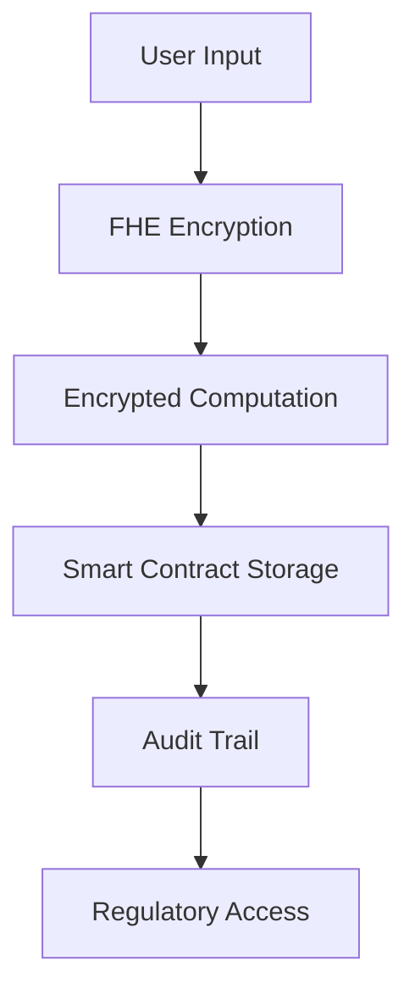

# 🌿 Verdant Vault Trades

> **Next-Generation Encrypted Trading Platform**  
> Built with cutting-edge FHE technology for institutional-grade privacy and security

## ✨ Key Features

- 🔐 **Zero-Knowledge Trading**: Execute trades without revealing sensitive data
- 📈 **Encrypted Portfolio Analytics**: Private performance tracking with FHE computation
- 🏦 **Secure Vault Management**: Create and manage encrypted investment strategies
- 🎯 **Reputation-Based System**: Anonymous yet verifiable trader credentials
- 🔗 **Multi-Wallet Support**: Connect with 20+ popular Web3 wallets
- 📋 **Compliance-Ready**: Built-in audit trails for regulatory requirements

## 🛠️ Technology Stack

| Category | Technology |
|----------|------------|
| 🎨 **Frontend** | React 18, TypeScript, Vite |
| 🎭 **UI Framework** | shadcn/ui, Tailwind CSS |
| 🔗 **Web3 Integration** | Wagmi, RainbowKit, Viem |
| ⛓️ **Blockchain** | Ethereum Sepolia Testnet |
| 🔒 **Encryption** | FHE (Fully Homomorphic Encryption) |
| 📜 **Smart Contracts** | Solidity with FHE support |

## 🚀 Quick Start

### 📋 Prerequisites

- ⚡ Node.js 18+ 
- 📦 npm or yarn
- 🔧 Git

### 🛠️ Installation

```bash
# 1️⃣ Clone the repository
git clone https://github.com/ChainBuilder88/verdant-vault-trades.git
cd verdant-vault-trades

# 2️⃣ Install dependencies
npm install

# 3️⃣ Configure environment variables
cp .env.example .env.local
# Edit the environment variables with your keys

# 4️⃣ Start development server
npm run dev

# 5️⃣ Open browser to http://localhost:8080
```

## 📜 Smart Contract Architecture

Our FHE-enabled smart contracts provide institutional-grade security:

| Contract | Purpose | FHE Features |
|----------|---------|--------------|
| 🏦 **VerdantVaultTrades.sol** | Main trading contract | Encrypted trade execution |
| 📊 **Portfolio Management** | Private portfolio tracking | FHE computation on encrypted data |
| 🔐 **Vault Operations** | Secure vault creation | Encrypted performance metrics |
| 🛡️ **Reputation System** | Anonymous verification | Zero-knowledge reputation proofs |

### 🚀 Contract Deployment

> **Note**: Smart contract deployment is separate from frontend deployment. The frontend can be deployed to Vercel without FHE dependencies.

```bash
# For smart contract deployment (separate from frontend)
npm install --save-dev hardhat @nomicfoundation/hardhat-toolbox

# Deploy contracts to Sepolia testnet
npx hardhat run scripts/deploy.ts --network sepolia

# Update contract addresses in your environment variables
```

## 🏗️ Architecture Overview

### 🔒 FHE Integration

Our platform leverages Fully Homomorphic Encryption for unprecedented privacy:



### 🛡️ Security Features

| Feature | Description | Benefit |
|---------|-------------|---------|
| 🔐 **Zero-Knowledge Proofs** | Verify without revealing data | Complete privacy |
| 📊 **Encrypted Analytics** | Compute on encrypted data | Private insights |
| 🎯 **Selective Disclosure** | Control data visibility | User autonomy |
| 📋 **Audit Compliance** | Regulator access when needed | Regulatory compliance |

## 📚 API Reference

### 🔄 Trade Operations

| Function | Parameters | Returns | Description |
|----------|------------|---------|-------------|
| `executeTrade` | `(assetType, amount, price, isBuy)` | `uint256` | Execute encrypted trade |
| `getTradeInfo` | `(tradeId)` | `TradeInfo` | Retrieve trade details |
| `deactivateTrade` | `(tradeId)` | `void` | Deactivate trade |

### 🏦 Vault Management

| Function | Parameters | Returns | Description |
|----------|------------|---------|-------------|
| `createVault` | `(name, description, initialAssets)` | `uint256` | Create new vault |
| `getVaultInfo` | `(vaultId)` | `VaultInfo` | Get vault details |
| `updateVaultPerformance` | `(vaultId, performance)` | `void` | Update performance |
| `verifyVault` | `(vaultId, isVerified)` | `void` | Verify vault (verifier only) |

### 📊 Portfolio Management

| Function | Parameters | Returns | Description |
|----------|------------|---------|-------------|
| `getPortfolioInfo` | `(trader)` | `PortfolioInfo` | Get portfolio data |
| `setPortfolioPrivacy` | `(trader, isPrivate)` | `void` | Set privacy settings |

## 🤝 Contributing

We welcome contributions from the community! Here's how to get started:

```bash
# 1️⃣ Fork the repository
# 2️⃣ Clone your fork
git clone https://github.com/YOUR_USERNAME/verdant-vault-trades.git

# 3️⃣ Create feature branch
git checkout -b feature/amazing-feature

# 4️⃣ Make your changes
# 5️⃣ Commit and push
git commit -m 'Add amazing feature'
git push origin feature/amazing-feature

# 6️⃣ Open a Pull Request
```

## 📄 License

This project is licensed under the MIT License - see the [LICENSE](LICENSE) file for details.

## 🆘 Support & Community

| Resource | Description |
|----------|-------------|
| 🐛 **Bug Reports** | [GitHub Issues](https://github.com/ChainBuilder88/verdant-vault-trades/issues) |
| 💬 **Discord** | Join our community discussions |
| 📖 **Documentation** | Comprehensive guides and API docs |
| 🎓 **Tutorials** | Step-by-step learning resources |

## 🗺️ Roadmap

- [ ] 🌐 Multi-chain support (Polygon, Arbitrum, Optimism)
- [ ] 🔬 Advanced FHE operations and optimizations
- [ ] 📱 Mobile app development (React Native)
- [ ] 🏛️ Institutional-grade features
- [ ] 🔗 Cross-platform integrations
- [ ] 🎯 Advanced analytics and reporting

---

<div align="center">

**Built with 🌿 by the Verdant Vault team**

*Empowering private, secure, and compliant financial transactions*

</div>